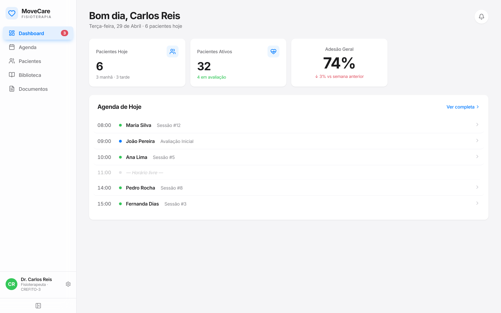
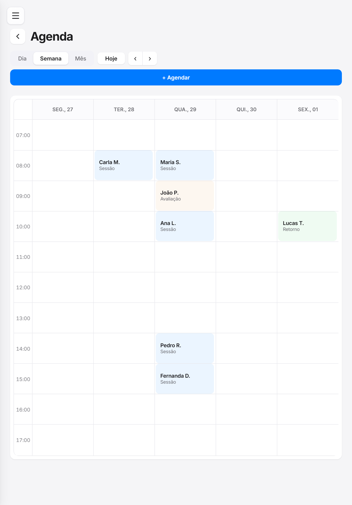
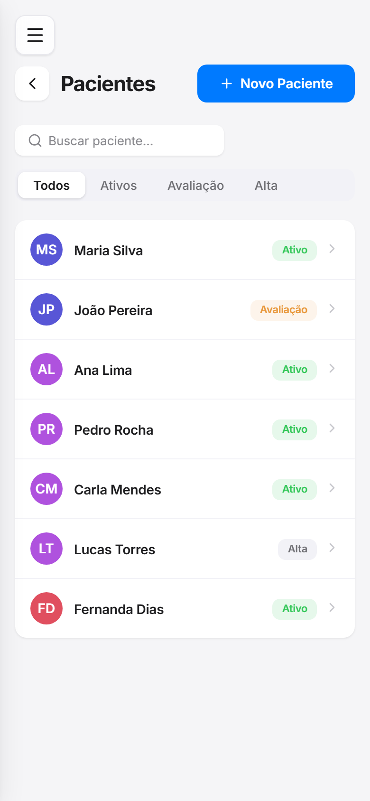

# MoveCare

MoveCare is a practice management web app for physiotherapists. It brings the
day-to-day of a clinic into a single interface: the day's schedule, the patient
roster, treatment plans, progress tracking, an exercise library, and documents.
It is built as an installable PWA, so it works on phones, tablets, and desktops
from the same codebase.

## What it does

- **Dashboard**: daily greeting, key stats (patients today, active patients,
  overall adherence), and the day's agenda at a glance.
- **Agenda**: day, week, and month calendar views of appointments, with
  scheduling, powered by FullCalendar.
- **Patients**: searchable, filterable roster (active, under evaluation,
  discharged) with per-patient detail, treatment plan, progress, assessments,
  and documents.
- **Library**: a catalog of reusable exercises that feed into treatment plans.
- **Documents**: clinic and patient document management.

The interface is available in English, Spanish, and Portuguese (auto-detected
from the browser, Portuguese by default).

## How it works

- **React 19 + TypeScript**, bundled with **Vite**.
- **React Router** drives client-side navigation; non-landing routes are
  code-split and lazy-loaded, keeping FullCalendar out of the initial bundle.
- A **services + lib** layer sits between the UI and the data, so pages read
  from `dashboardService`, `patientService`, and `agendaService` rather than
  touching raw data. Sample data lives in `src/data/mock.json`.
- **react-i18next** handles localization; locale strings live in
  `src/i18n/locales/<lang>/`.
- **vite-plugin-pwa** provides the installable, offline-capable shell.

## Screenshots

| Desktop (Dashboard) | Tablet (Agenda) | Mobile (Patients) |
| --- | --- | --- |
|  |  |  |

## Setup

Requires Node.js 20+ and npm.

```bash
# install dependencies
npm install

# start the dev server (http://localhost:5173)
npm run dev

# type-check and build for production
npm run build

# preview the production build locally
npm run preview

# lint
npm run lint
```

## Project structure

```
src/
  components/   shared UI (Layout, Sidebar, etc.)
  pages/        route views (Dashboard, Agenda, Pacientes, ...)
  services/     data access used by pages
  lib/          lower-level helpers behind the services
  data/         mock data
  i18n/         localization setup and locale strings
  types/        shared TypeScript types
```
